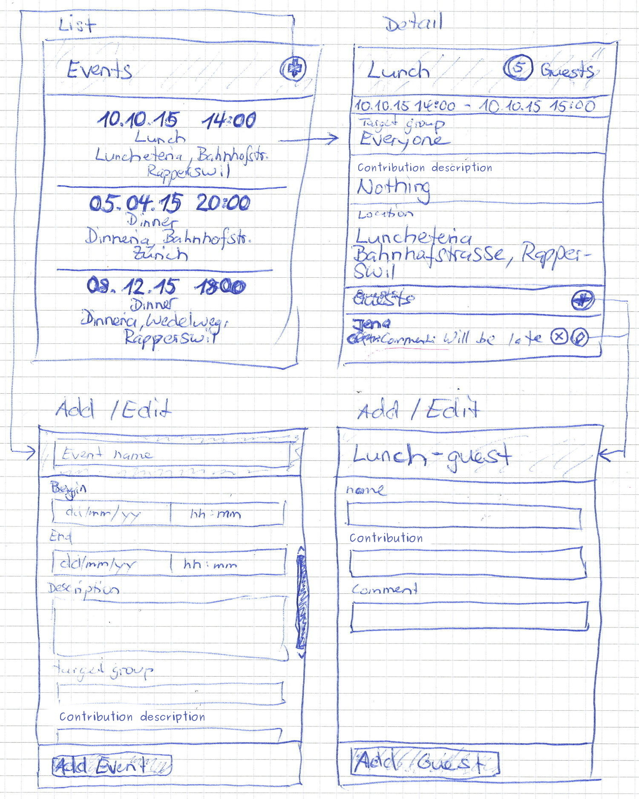

# Event Applikation

## Usage

Start node server:
```bash
cd App/server
npm install
node server.js
```

Go to localhost:8080

you'll see the Angular-frontend of the application

Go to localhost8080/tests

you'll see the the jasmine test suites

Go to localhost:8080/api

you'll see specified backend api


## Daten Model

```yaml
Event:
	id [string]
	name [string]
	description [string]
	targetGroup [string]
	contributionsDescription [string]
	location:
		name [string]
		street [string]
		zipCode [string]
		city [string]
	times:
		begin [Date]
		end [Date]
	maximalAmoutOfGuests [number]
	guests [Guest[]]

	\begin
	\end

Guest:
	id [string]
	name [string]
	contribution [string]
	comment [string]
	canceled [boolean=false]

```

## Event API

```yaml
All events
	- GET /api/events
	- Example: localhost:8080/api/events
Add event
	- POST /api/events/
	- Example: POST localhost:8080/api/events/
		- Header: Content-Type: application/json 
		- Body: { "name": "Dinner", "description": "...", "times":{"begin":"2015-11-15T19:00:00.000Z","end":"2011-11-16T03:00:00.000Z"}, "location", { ... }, ... }
Event by id
	- GET /api/events/{eventID}
	- Example: localhost:8080/api/events/1
Update event
	- POST /api/events/{eventID}
	- Example: POST localhost:8080/api/events/1
		- Header: Content-Type: application/json 
		- Body: { "description": "new Description", "location", { city: "new City", ... } }
Guests of one event
	- GET /api/events/{eventID}/guests
	- Example: localhost:8080/api/events/1/guests
Add guest
	- POST /api/events/{eventID}/guests
	- Example: POST localhost:8080/api/events/1/guests
		- Header: Content-Type: application/json 
		- Body: { "name": "Diana", "gift": "Cake", "comment": "" }
Guest by id
	- GET /api/events/{eventID}/guests/{guestID}
	- Example: localhost:8080/api/events/1/guests/1
Update guest
	- POST /api/events/{eventID}/guests/{guestID}
	- Example: POST localhost:8080/api/events/1/guests/1
		- Header: Content-Type: application/json 
		- Body: { "canceled": true }
```

## Benutzeroberfläche



## Testat Kriterien

- Die Applikation funktioniert in Firefox und Chrome (FF 40+, GC 45+).
- Alle User-Stories wurden umgesetzt.
- Die Applikation ist als Client-Server Applikation aufgebaut. Die Client-Applikation basiert auf AngularJS/JavaScript.
- Die Applikation nutzt eine REST-Schnittstelle zum Datenaustausch mit dem Server (Persistenz). Ein Node.js-Server wird von uns vorgegeben, es ist jedoch auch erlaubt, eine eigene Implementation zu erstellen (beliebige Technologie), welche die gleiche REST-Schnittstelle anbietet. Der von uns angebotene Node.js Server darf auch verändert/erweitert werden.
- Zur Kommunikation mit dem Server wird der AngularJS Ajax Service verwendet.
- Zur Verwaltung der Events und Gäste werden Services/Repositories eingesetzt.
- Die Applikation besteht aus mindestens vier verschiedenen Views. Mindestens zwei Views manipulieren Daten (Forms). Zur Navigation zwischen den Views wird die Routing Komponente von Angular eingesetzt.
- Die Benutzeroberfläche besitzt mindestens ein funktionales, minimales Styling. CSS-Frameworks wie Foundation oder Bootstrap dürfen verwendet werden (keine Bootstrap JS!).
- Responsive Design (360px*576px - 1920px*1080).
- Für Formulare wird, wo sinnvoll, HTML5-Formvalidierung + AngularJS Formvalidierung verwendet.
- Für mindestens folgende Aktionen/Komponenten existieren Jasmine-Tests mit gemockten Services:
	- Test der Scope Variablen auf Korrektheit/Vollständigkeit im List-Controller mit mindestens 3 Datensätzen (Events).
	- Create Event View: Test über erfolgreiches Anlegen eines neuen Events
	- Add Guest View: Test über erfolgreiches Hinzufügen eines neuen Gastes
	- Test jeder Repository-Methode/API-Calls mit gemocktem $httpBackend.
